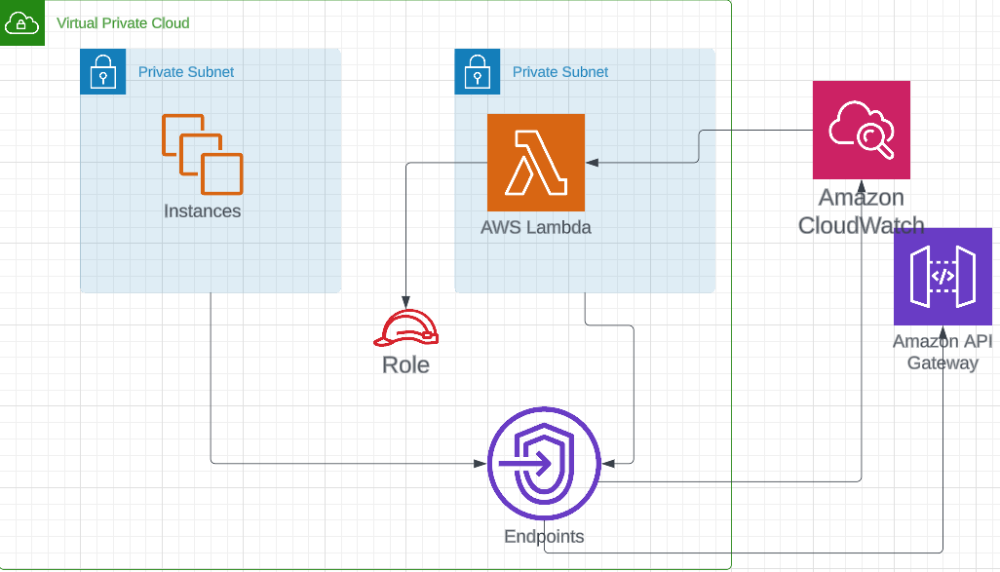

# Secure Private API Deployment

The Secure Private API Deployment project showcases the ability to securely deploy a private API using AWS Cloud Development Kit (CDK) and related services. This project aims to provide a highly controlled and secure access point for an API, ensuring that it can only be accessed by authorized clients within a Virtual Private Cloud (VPC) environment.



## Description

The Secure Private API Deployment project utilizes AWS CDK to create an infrastructure stack called "SecurePrivateApiStack". This stack deploys the necessary AWS resources to establish a secure private API. The key components of the project include:

- **Serverless Event Processor**: A Lambda function named "serverless_py" is created to handle API requests. This function is designed to execute within a 15-second time limit and has a reserved concurrency of 1. It is associated with an API Gateway endpoint, providing a scalable and efficient solution for processing API requests.

- **Custom Log Group**: A dedicated log group named "CloudwatchLoggroup" is created to store the function's logs. This log group retains log data for one week, offering visibility and troubleshooting capabilities to monitor the API's performance and diagnose any issues.

- **Private Secure Endpoint**: An Interface VPC Endpoint named "interface_vpcepoint" is established to enable a secure and private connection between the API Gateway and the VPC. This endpoint is associated with a security group that allows inbound traffic on port 443, ensuring that communication remains secure. It is specifically designed to work with isolated subnets within the VPC, maintaining network segregation and enhancing overall security.

- **API Gateway**: An API Gateway named "secbackendAPI" is deployed with the "prod" stage. This API Gateway is configured as a private endpoint, meaning it can only be accessed from within the associated VPC. A resource policy is implemented to enforce access restrictions, allowing only authorized requests from within the VPC while denying all other non-VPC access attempts.

## Deployment Steps

To deploy the Secure Private API, follow these steps:

1. Clone the repository: `git clone https://github.com/TagDhanyal/secure-private-api-deployment.git`
2. Navigate to the project directory: `cd secure-private-api-deployment`
3. Install the required dependencies: `pip install -r requirements.txt`
4. Modify the deployment configuration if needed.
5. Deploy the infrastructure stack using AWS CDK: `cdk bootstrap, cdk ls, cdk deploy`
6. After successful deployment, the API endpoint URL will be provided as an output. Use this URL to access the secure private API within the VPC.

# Testing the API

To ensure the successful deployment and functionality of the Secure Private API, follow these testing steps:

1. **Retrieve URLs**: The necessary URLs can be found in the Outputs section of the `Private_secured_api` stack.

2. **Deploy EC2 Instance**: To test the solution within the same VPC, utilize the provided template to deploy an EC2 instance. This instance will be deployed in the same VPC and security group as the API Gateway, ensuring seamless testing. You can log in to the instance using Systems Manager or create your own instance.

3. **Initiate Deployment**: Deploy the EC2 instance stack by executing the following command:

   ```bash
   cdk deploy api_trigger
   
Send API Requests: After the deployment is complete, use the curl command to send a GET request to the API. For example:
    curl -X GET https://p35nrnhb3m.execute-api.us-east-1.amazonaws.com/tagdhanyal/secure/hello
    
Verify Response: The expected output should resemble the following:
    {"message": "Hi Dhanyal World, Hello from Lambda running at X.XXX.XXX.XXX"}
    
Check Access Restrictions: To test the secure configuration of the SecureApiUrl, try accessing it from your browser, Postman tool, or curl. An error message should be displayed, indicating restricted access. For instance:
    $ curl https://r56cvnhb5m.execute-api.us-east-1.amazonaws.com/tagdhanyal/secure/hello
    curl: (6) Could not resolve host: r56cvnhb5m.execute-api.us-east-1.amazonaws.com
    
Verify VPC DNS Resolution: To confirm the successful resolution of SecureApiUrl within the VPC, perform an nslookup {SecureApiUrl_Domain} in the EC2 instance. This should yield a successful response from the VPC DNS Server. For instance:
    $ nslookup p35nrnhb3m.execute-api.us-east-1.amazonaws.com
    Server:         10.10.0.2
    Address:        10.10.0.2#53

    Non-authoritative answer:
    r56cvnhb5m.execute-api.us-east-1.amazonaws.com  canonical name = execute-api.us-east-1.amazonaws.com.
    Name:   execute-api.us-east-1.amazonaws.com
    Address: 10.10.2.13
    Name:   execute-api.us-east-1.amazonaws.com
    Address: 10.10.3.160

## Cleanup

To clean up the resources created by the Secure Private API Deployment, use the following command:

    cdk destroy

## Benefits

The Secure Private API Deployment project demonstrates expertise in designing and deploying secure API infrastructures using AWS CDK, Lambda functions, API Gateway, and VPCs. This project offers numerous benefits for cloud engineering and cloud architect roles, including:

- **Enhanced Security**: The private API is accessible only within the VPC, ensuring that unauthorized access from external sources is prohibited. It provides a robust security layer to safeguard sensitive data and protect against potential attacks.

- **Scalability and Performance**: Leveraging the serverless nature of Lambda functions and the scalability of API Gateway, the solution can handle increasing API traffic without compromising performance. It automatically scales based on demand, providing a seamless and efficient experience for users.

- **Infrastructure-as-Code Principles**: By utilizing AWS CDK, the infrastructure stack can be easily reproduced in different environments or regions using the same codebase. This ensures consistency and reduces manual configuration errors, simplifying the deployment process.

- **Maintainability and Version Control**: Infrastructure changes can be managed through code versioning, enabling better control and traceability of changes. It allows for easier collaboration among team members and simplifies the rollback process if needed.

- **Operational Visibility**: Logs from the Lambda function are stored in a dedicated log group, facilitating easy troubleshooting and monitoring of API requests. It provides valuable insights into the system's behavior, enabling proactive identification and resolution of potential issues.
